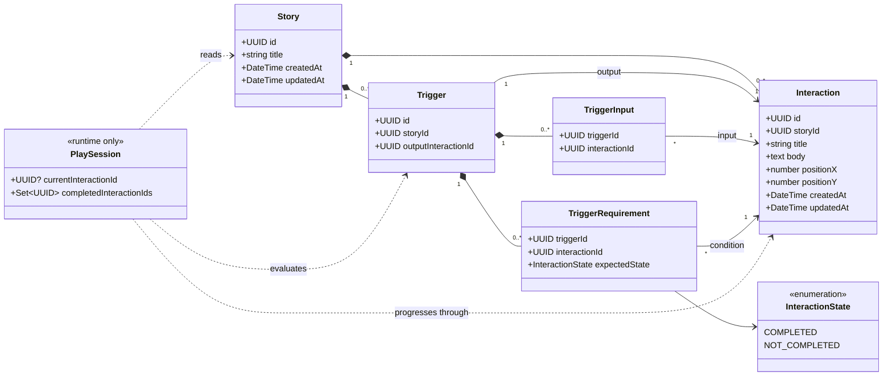
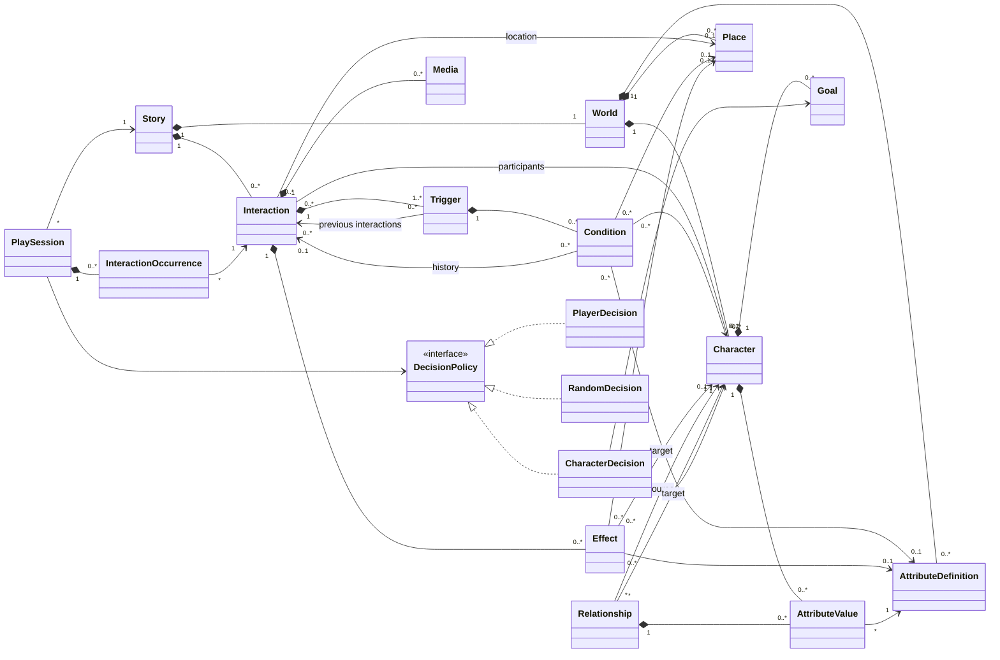

# UML de Paralleax

Ce dossier distingue volontairement le modèle réellement ciblé par le premier MVP de la vision à long terme.

## 1. Diagramme de classes du MVP

Le MVP contient uniquement :

- des stories ;
- des interactions positionnées dans l’éditeur ;
- des triggers reliant une ou plusieurs interactions d’entrée à une interaction de sortie ;
- des conditions fondées sur le fait d’avoir déjà parcouru, ou non, certaines interactions ;
- un état de lecture local et non persisté.

### Règle d’éligibilité d’un trigger

Un trigger est proposé par le lecteur lorsque :

1. au début de la story, il ne possède aucune interaction d’entrée ; ou, pendant la lecture, l’interaction courante fait partie de ses entrées ;
2. toutes ses exigences `COMPLETED` figurent dans l’historique de lecture ;
3. aucune de ses exigences `NOT_COMPLETED` ne figure dans cet historique.

Plusieurs interactions d’entrée sur un même trigger représentent un **OU** : chacune peut mener à la même interaction de sortie. Les conditions d’un trigger représentent un **ET** : elles doivent toutes être vérifiées.

## 2. Diagramme de classes Vision

Ce diagramme sert uniquement de boussole. Il ne constitue pas le backlog du MVP et ne doit pas complexifier son modèle.

## Choix de conception retenus pour le MVP

- `Interaction` reste indépendante de `Trigger`, comme dans le prototype.
- Un trigger possède exactement une interaction de sortie.
- Une interaction peut avoir plusieurs triggers : cela permet plusieurs ensembles alternatifs de conditions.
- Les entrées et les conditions sont modélisées par des tables d’association plutôt que par des tableaux d’identifiants. Cela convient à PostgreSQL et évite d’enfermer l’API dans le stockage choisi.
- Le lecteur ne sauvegarde pas encore les parties.
- Les personnages, lieux, attributs, effets, médias, temporalités et probabilités appartiennent uniquement à la Vision.
