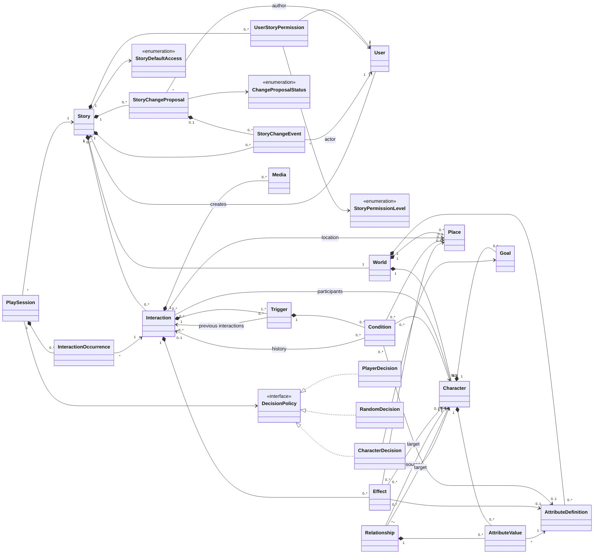

# Paralleax UML

This folder deliberately separates the first MVP target model from the long-term vision.

The checked-in UML sources are Mermaid (`.mmd`) and PlantUML (`.puml`) text
files. Generated image renders are intentionally not stored so diagrams do not
drift from the editable sources.

## 1. MVP Class Diagram

The MVP only contains:

- stories;
- interactions positioned in the editor;
- triggers linking one or more input interactions to an output interaction;
- conditions based on whether some interactions have already been visited or not;
- a local, non-persisted reader state.

### Trigger Eligibility Rule

A trigger is offered by the reader when:

1. at the beginning of the story, it has no input interaction; or, during reading, the current interaction is part of its inputs;
2. all `COMPLETED` requirements are present in the reading history;
3. none of its `NOT_COMPLETED` requirements are present in that history.

Several input interactions on the same trigger represent an **OR**: each can lead to the same output interaction. Trigger conditions represent an **AND**: all of them must be verified.

## 2. Vision Class Diagram

This diagram is only a compass. It is not the MVP backlog and must not make the MVP model more complex.

## MVP Design Choices

- `Interaction` remains independent from `Trigger`, as in the prototype.
- A trigger has exactly one output interaction.
- An interaction can have several triggers: this allows several alternative condition sets.
- Inputs and conditions are shown as separate conceptual associations and map to
  the relational `trigger_inputs` and `trigger_conditions` tables.
- The reader does not persist play sessions yet.
- Characters, places, attributes, effects, media, temporal concepts, and probabilities belong only to the Vision.
- Users, story permissions, and change proposals also belong only to the Vision.
  They depend on authentication and post-MVP collaboration rules.
